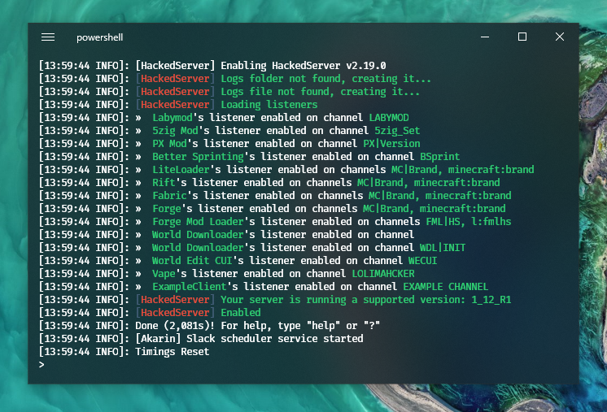

# Getting started

## Installing HackedServer on Spigot

### For 1.17 and superior

First drop HackedServer.jar, [HackedCore.jar](https://www.spigotmc.org/resources/hackedcore-hackedserver-library.68979/) and [ProtocolLib](https://www.spigotmc.org/resources/protocollib.1997/) to your /plugins/ folder and restart your server.

### For older versions

First drop HackedServer.jar, [HackedCore.jar](https://www.spigotmc.org/resources/hackedcore-hackedserver-library.68979/) to your /plugins/ folder and restart your server. You need to use the version 2.80.0 of HackedServer which can be downloaded [here](https://www.spigotmc.org/resources/%E2%80%8D%E2%9C%85-25-%E2%98%A0%EF%B8%8F-hackedserver-mods-clients-detector.46485/download?version=401048).&#x20;


&#x20;HackedServer has been tested with Spigot, CraftBukkit, PaperSpigot, TacoSpigot and Akarin


If all goes well you should get something like this :

### Installing HackedServer on Bungeecord

Start by installing HackedServer on every spigot servers as explained previously. Be sure that `bungeecord` is set to true in your **spigot.yml** configurations and `ip_forward` enabled in your bungeecord **config.yml**.\
\
Then drop HackedServer.jar (it's the same jar as for spigot) to your bungeecord /plugins/ folder and restart it. There should be only a simple log saying that the plugin is well loaded since its main feature is fixing bungee incompatibility (it also brings some debug features):


If you are using a proxy like waterfall or travertine, set`forge_support: false` in config.yml

