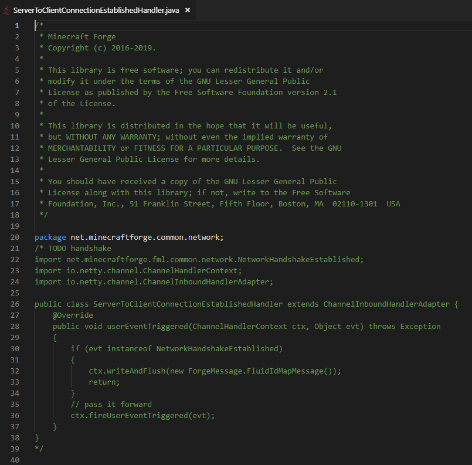

# Compatibility

### Spigot and forks

HackedServer works on all versions of Spigot from 1.8 and even supports different forks of Spigot like [PaperMC](https://papermc.io/), [TacoSpigot](https://tacospigot.github.io/) or [Akarin](https://github.com/Akarin-project/Akarin), just follow the instructions in the [dedicated section](./#installing-hackedserver-on-spigot).


Spigot 1.7 is no longer supported since 2.x but you can still download the last 1.x version [here](https://www.spigotmc.org/resources/hackedserver-forge-mods-clients-detector-spigot-and-bungee.46485/download?version=231693)


### Bungeecord

If you are using a proxy like bungeecord you need to install HackedServer.jar in the proxy plugins folder too in order to fix forge mods detection, follow the instructions in [this section](./#installing-hackedserver-on-bungeecord).

### Forge version

With the arrival of the 1.13 a big part of forge is being rewritten, unfortunately the current experimental versions (available for 1.13 and 1.14) do not yet have handshake. Without this handshake I can not detect them unfortunately, however HackedServer already has an architecture allowing it to be updated very quickly to be compatible as soon as it is possible for the forge side.

Here is a screen of the Class in question (taken by the very kind tr7zw):

In addition to its preparation for the future HackedServer is using able to generate Java bytecode on the fly. This very barbaric sentence means that HackedServer is able to generate different packets depending on the player version and regardless of the server version. So even if the detection of forge mods for 1.13 players is not supported, it is possible to detect the mods of a player using forge 1.12 on a 1.13 server (with ProtocolSupport or ViaBackwards for example). I must admit that it took me a lot of time to achieve and I hope it will help someone.
